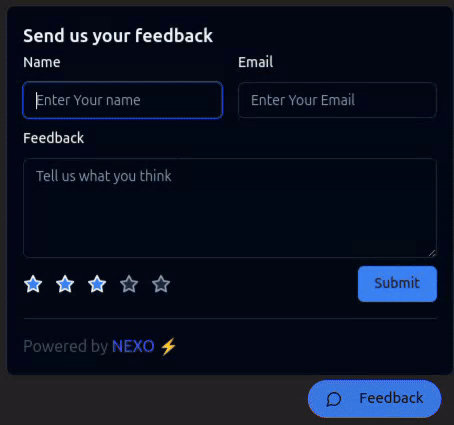

# **NEXO Widget Demo** 🚀

Easily integrate **NEXO** and start collecting feedback like a pro!  
Below is a quick demo of the widget in action.  

---

## **Preview** 🌟



---

## **Why Choose NEXO?** 🤔

✅ **Seamless Integration**: Add it to your projects in no time.  
✅ **User-Friendly Interface**: Designed for efficiency and simplicity.  
✅ **Customizable**: Tailor the widget to your needs with ease.  
✅ **Scalable**: Suitable for projects of all sizes.

---

## **Get Started** 🚀

1. Clone the repository:
   ```bash
   git clone https://github.com/gouravkundu7370/nexo-widget
   cd nexo
2. Install Dependencies:
    ```bash
    npm install
3. Run the development server:
    ```bash
    npm run dev
4. Open http://localhost:3000 to see the widget in action!

## **Contribute** 🙌

We welcome contributions to improve **NEXO**!  
Feel free to submit a pull request or open an issue to share your ideas and enhancements.

---

## **Stay Connected** 🌐

Follow us on [GitHub](https://github.com/gouravkundu7370/nexo-widget) for updates, new features, and the latest news!  
Don't forget to star ⭐ the repository if you find it helpful!


